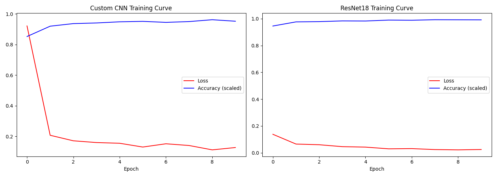
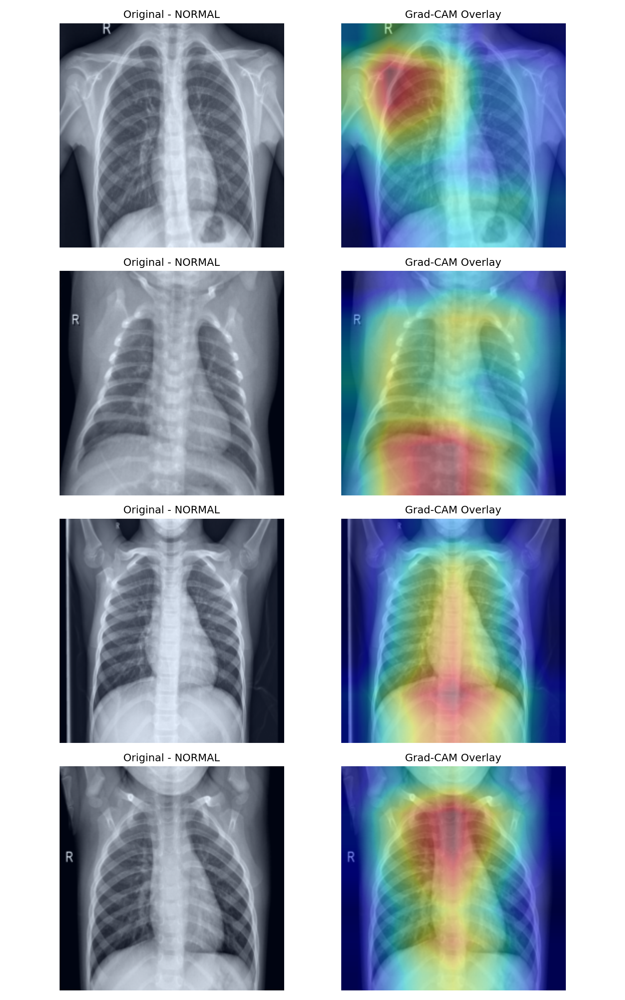

# Pneumonia Detection from Chest X-Rays

A comparative study of Custom CNN vs ResNet18 transfer learning for binary 
classification of pneumonia from chest X-ray images, with Grad-CAM explainability.

## Results

| Model | Test Accuracy | NORMAL Recall | PNEUMONIA Recall |
|---|---|---|---|
| Custom CNN | 79% | 46% | 99% |
| ResNet18 | 90% | 75% | 99% |

## Key Findings

- Transfer learning (ResNet18) outperforms a custom CNN by 11% on limited medical data
- Class imbalance (3875 pneumonia vs 1341 normal) addressed via weighted loss
- Grad-CAM confirms model attends to clinically relevant lung regions

## Visualizations

### Training Curves

### Grad-CAM Overlays

## Tech Stack
- PyTorch
- torchvision (ResNet18)
- Grad-CAM
- scikit-learn

## Dataset
[Chest X-Ray Images (Pneumonia)](https://www.kaggle.com/datasets/paultimothymooney/chest-xray-pneumonia) — 5,863 images

## How to Run
Open `pneumonia_detection_cnn.ipynb` in Google Colab and run all cells.
